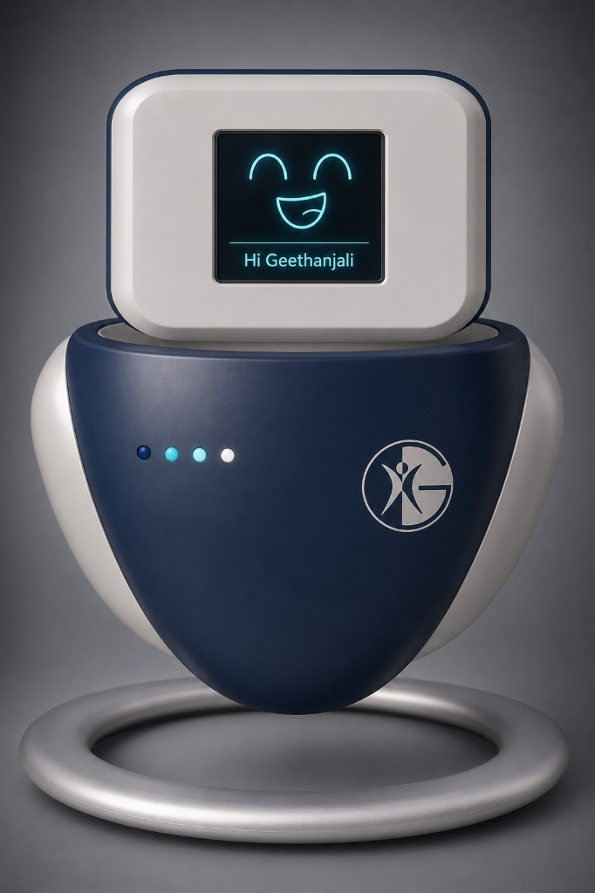

# GreetBot 🤖

<p align="center">
  
  
</p>

An interactive, hands-free companion robot featuring a glowing **EVE-style (Wall-E) animated LED anime face** rendered in Pygame, voice activity detection (VAD), local faster-whisper speech-to-text, and a dual-backend reasoning brain (Groq Cloud / Local Ollama).

---

## Key Features

*   **EVE-Style LED Anime Visor**: Dynamic Pygame interface displaying glowing cyan LED capsule eyes that animate based on 5 emotion states (`NEUTRAL`, `HAPPY`, `SAD`, `SURPRISED`, `THINKING`) with scanlines and randomized natural blinking.
*   **Resolution-Agnostic Scaling**: Draws to a virtual $800 \times 480$ canvas and dynamically scales up (`pygame.transform.smoothscale`) to fit any physical screen size. Supports **F11** to toggle fullscreen and **ESC** to exit cleanly.
*   **VAD-Based Audio Capture**: Energy-based Voice Activity Detection dynamically records natural speech and pauses. The default noise threshold is tuned to **1400** (optimized for room ambient noise floors of 700-1000 RMS) to prevent infinite recording loops.
*   **Persistent User Memory**: Automatically saves a user's name and facts to `memory.json`. 
    *   *Direct shortcuts*: Instant saving/retrieval for phrases like "my name is X", "what's my name", and "forget everything".
    *   *LLM context injection*: Stored facts are automatically folded into the LLM system prompt context, allowing the bot to organically remember details when asked natural questions.
*   **Three-Tier Reasoning Engine**:
    1.  *Instant Python Shortcuts*: Real-time responses for date, time, day, bot identity, and memory commands.
    2.  *Keyword KB Lookup*: Querying `knowledge_base.json` for factual data (college details, personnel, placement figures).
    3.  *LLM Fallback*: Using Groq Cloud or a local 3B model (Ollama) for conversational replies.
*   **Autostart & Pre-Warm Boot**: Boots automatically on Pi startup, pre-warms the Ollama model to RAM via a warmup call, sets screen control, and runs headless logging.

---

## File Structure

*   `brain.py`: Shared reasoning module. Contains direct shortcuts, KB matching, memory handling, and backend dispatch.
*   `robo_head_mac.py`: macOS entry point using CoreAudio (`sounddevice` streams) and macOS `say` fallbacks.
*   `robo_head.py`: Raspberry Pi entry point using PipeWire (`pw-record` streams, `paplay` output) and `/dev/shm/` RAM disk.
*   `knowledge_base.json`: Local factual database (college details, club info, placement stats).
*   `memory.json`: Local persistent user database (name, facts).
*   `pi_optimizer.sh`: Hardware and scheduling prioritization optimizer for Raspberry Pi.
*   `start_greetbot.sh`: Autostart script that disables screen-blanking, warms Ollama, and launches the python loop.
*   `api_server.py`: FastAPI server for remote/global API queries.

---

## Configuration

GreetBot is configured using environment variables:

| Variable | Description | Default (Mac) | Default (Pi) |
| :--- | :--- | :--- | :--- |
| `BRAIN_BACKEND` | LLM backend to run (`groq` or `ollama`) | `groq` | `ollama` |
| `GROQ_API_KEY` | Your Groq Cloud API Key | *None* | *N/A* |
| `WHISPER_MODEL` | Size of Whisper model for STT (`tiny.en` / `base.en`) | `base.en` | `tiny.en` |
| `VAD_SPEECH_THRESHOLD` | Sensitivity threshold of VAD | `350` | `1400` |

---

## Setup & Running Guide

### 💻 macOS (Development & Testing)

1.  **Activate virtual environment & install dependencies**:
    ```bash
    source venv/bin/activate
    pip install numpy pygame sounddevice requests faster-whisper
    ```
2.  **Run with Groq Backend**:
    ```bash
    export GROQ_API_KEY="your_groq_key_here"
    export BRAIN_BACKEND="groq"
    python3 robo_head_mac.py
    ```

---

### 🍓 Raspberry Pi 5 (Local Model Target)

#### 1. System Dependencies Setup
```bash
sudo apt update
sudo apt install pipewire-utils espeak unclutter-xfixes
python3 -m venv venv
source venv/bin/activate
pip install numpy pygame requests faster-whisper
```

#### 2. Run local Ollama in Docker & Pull the 3B model
```bash
docker run -d -v ollama:/root/.ollama -p 11434:11434 --name ollama ollama/ollama
docker exec -it ollama ollama run llama3.2:3b
```

#### 3. Mic Routing (PipeWire)
Since the Pi's audio devices can shift between reboots:
1.  Find the source ID of your microphone and sink ID of your speaker:
    ```bash
    wpctl status
    ```
2.  Manually set your default mic and speaker:
    ```bash
    wpctl set-default <mic_source_id>
    wpctl set-default <speaker_sink_id>
    ```

#### 4. Run System Performance Optimizer
```bash
sudo ./pi_optimizer.sh
```

#### 5. Autostart Setup (XDG Desktop Entry)
To make GreetBot boot directly on startup on the Raspberry Pi:
1.  **Create the startup script** `~/greetbot/start_greetbot.sh`:
    ```bash
    #!/usr/bin/env bash
    # Disable screen blanking
    xset s off
    xset -dpms
    xset s noblank

    export VAD_SPEECH_THRESHOLD=1400
    export BRAIN_BACKEND="ollama"
    
    # Delete old wav files and pycaches
    rm -f ~/greetbot/data/*.wav
    rm -rf ~/greetbot/__pycache__

    # Wait for Ollama service to start up
    until curl -s http://localhost:11434/api/tags > /dev/null; do
        sleep 1
    done

    # Pre-load/warm the model in memory
    curl -X POST http://localhost:11434/api/generate -d '{"model": "llama3.2:3b", "keep_alive": "30m"}'

    # Run the bot in venv logging output to file
    /home/robotics/venv/bin/python3 ~/greetbot/robo_head.py > ~/greetbot/data/boot.log 2>&1
    ```
2.  Make the script executable: `chmod +x ~/greetbot/start_greetbot.sh`
3.  **Create XDG Autostart File** `~/.config/autostart/greetbot.desktop`:
    ```text
    [Desktop Entry]
    Type=Application
    Name=GreetBot
    Exec=/home/robotics/greetbot/start_greetbot.sh
    ```

---

## Customizing Facts (`knowledge_base.json`)
You can edit the `knowledge_base.json` next to `brain.py` at any time. Changes to college officials, placement stats, and club descriptions are reloaded **dynamically** in real time without restarting the GreetBot script or API server.
