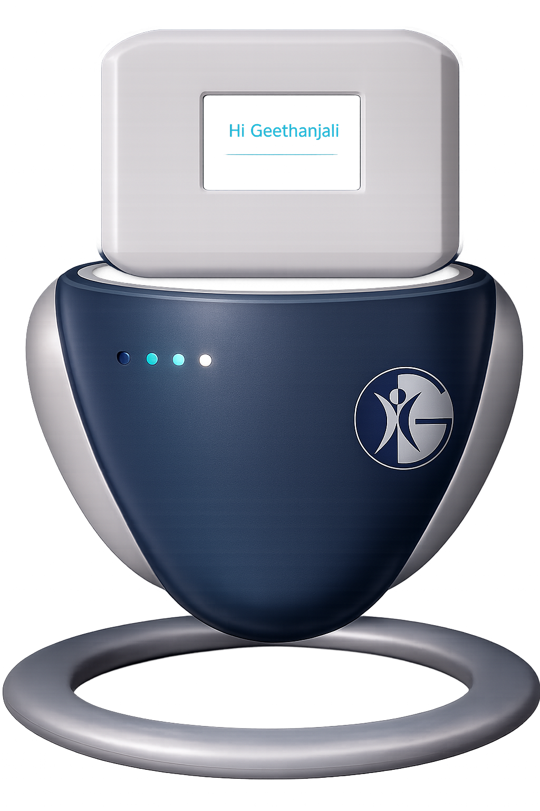

# GreetBot 🤖

<p align="center">
  
  
  
</p>

<p align="center">
  
  
  
  
</p>

<p align="center">
  <b>GreetBot</b> is a premium, hands-free tabletop companion robot designed for academic environments. Featuring a responsive, expressive <b>EVE-style (Wall-E) digital anime face</b>, dynamic voice activity detection (VAD), and a persistent dual-layer memory system, GreetBot delivers local offline conversations under 2-3 seconds on the Raspberry Pi 5.
</p>

---

## ⚡ Core Tech Matrix

*   **Cybernetic Visor (Pygame)**: Rendered on a virtual $800 \times 480$ canvas and scaled via `smoothscale` to fit any physical screen. Features responsive EVE-style glowing cyan capsule eyes that blink randomly and shift across 5 emotional states (`NEUTRAL`, `HAPPY`, `SAD`, `SURPRISED`, `THINKING`) using custom pixel grids and visual scanlines.
*   **Acoustic VAD Core**: Dynamic audio recording using energy thresholds (defaults to **1400** to filter out room ambient noise).
*   **Dual-Layer Cognitive Memory**:
    *   *System Shortcuts*: Sub-millisecond direct regex lookup for commands ("my name is X", "what is my name", "forget everything").
    *   *Context Injection*: Automatic memory summary integration into Ollama's system prompt for organic recall.
*   **Pre-Warmed Ollama Pipeline**: Startup script pre-loads local LLM weights into RAM, ensuring offline replies respond in under 5 seconds.

---

## 🛠️ System Architecture

```text
       [ User Voice Input ]
                │
                ▼
      [ VAD Audio Capture ] (pw-record / sounddevice) -> RAM (/dev/shm)
                │
                ▼
     [ faster-whisper STT ] (tiny.en / base.en)
                │
                ▼
         [ GreetBot Brain ] (brain.py)
                │
         ┌──────┴──────────────┬────────────────────────┐
         │                     │                        │
         ▼                     ▼                        ▼
  [ Regex Shortcuts ]   [ KB Fact Check ]        [ LLM Dispatch ]
  (Names, Date/Time)    (knowledge_base.json)    (Local Ollama / Groq)
         │                     │                        │
         └─────────────┬───────┴────────────────────────┘
                       │
                       ▼
             [ Response Engine ]
                       │
         ┌─────────────┴─────────────┐
         ▼                           ▼
[ Visor Animation ]          [ Neural Speech TTS ]
(Pygame Face Rendering)      (Piper -> paplay / espeak)
```

---

## 📁 Repository Map

*   📂 `brain.py` — Shared cognitive reasoning pipeline (shortcuts, database lookups, local memory, API switches).
*   📂 `robo_head.py` — **Raspberry Pi 5 entry point** (PipeWire audio framework, memory-disk recording, dynamic visor).
*   📂 `robo_head_mac.py` — **macOS entry point** (CoreAudio framework, Piper/system say TTS).
*   📂 `pi_optimizer.sh` — Pi CPU governor optimizer and background process trimmer.
*   📂 `start_greetbot.sh` — Autostart boot script with pre-warm model commands.
*   📂 `knowledge_base.json` — Hot-reloadable factual database.
*   📂 `memory.json` — Persistent user memory registry.
*   📂 `api_server.py` — FastAPI global access gate.

---

## ⚙️ Configuration Portal

Configure the system via terminal environment variables:

```bash
export BRAIN_BACKEND="ollama"      # LLM Core: "ollama" or "groq"
export WHISPER_MODEL="tiny.en"     # Whisper Engine: "tiny.en" (Fast Pi) or "base.en" (Accurate)
export VAD_SPEECH_THRESHOLD=1400   # Mic Threshold: Tuned for room noise floor
export GROQ_API_KEY="gsk_..."      # Groq cloud credentials (if using cloud backup)
```

---

## 🚀 Installation & Launch Guide

<details>
<summary><b>💻 macOS Setup (Development & Simulation)</b></summary>

### 1. Environments & Packages
```bash
# Setup venv and install sounddevice/pygame drivers
source venv/bin/activate
pip install numpy pygame sounddevice requests faster-whisper
```

### 2. Launch
```bash
export GROQ_API_KEY="your_groq_key_here"
export BRAIN_BACKEND="groq"
python3 robo_head_mac.py
```
</details>

<details>
<summary><b>🍓 Raspberry Pi 5 Setup (Hardware Target)</b></summary>

### 1. Install System Audio Frameworks
```bash
sudo apt update
sudo apt install pipewire-utils espeak unclutter-xfixes
python3 -m venv venv
source venv/bin/activate
pip install numpy pygame requests faster-whisper
```

### 2. Run Ollama in Docker & Pull model
```bash
docker run -d -v ollama:/root/.ollama -p 11434:11434 --name ollama ollama/ollama
docker exec -it ollama ollama run llama3.2:3b
```

### 3. Dynamic Mic Routing
Verify your active USB hardware in the PipeWire hierarchy:
```bash
# List system sources/sinks
wpctl status

# Route defaults
wpctl set-default <mic_source_id>
wpctl set-default <speaker_sink_id>
```

### 4. Apply System Performance Boosters
```bash
chmod +x pi_optimizer.sh
sudo ./pi_optimizer.sh
```

### 5. Setup Boot Autostart
Make GreetBot launch in fullscreen automatically on desktop login:
1.  **Configure execution script** `~/greetbot/start_greetbot.sh`:
    ```bash
    #!/usr/bin/env bash
    xset s off
    xset -dpms
    xset s noblank

    export VAD_SPEECH_THRESHOLD=1400
    export BRAIN_BACKEND="ollama"
    
    rm -f ~/greetbot/data/*.wav
    rm -rf ~/greetbot/__pycache__

    until curl -s http://localhost:11434/api/tags > /dev/null; do
        sleep 1
    done

    # Warm model in memory
    curl -X POST http://localhost:11434/api/generate -d '{"model": "llama3.2:3b", "keep_alive": "30m"}'

    # Run fullscreen face
    /home/robotics/venv/bin/python3 ~/greetbot/robo_head.py > ~/greetbot/data/boot.log 2>&1
    ```
2.  Make executable: `chmod +x ~/greetbot/start_greetbot.sh`
3.  **Register XDG Autostart File** `~/.config/autostart/greetbot.desktop`:
    ```text
    [Desktop Entry]
    Type=Application
    Name=GreetBot
    Exec=/home/robotics/greetbot/start_greetbot.sh
    ```
</details>

---

## ⚡ Pi 5 Performance Tuning Checklist

*   [ ] Run `pi_optimizer.sh` to lock the CPU frequency governor to `performance`.
*   [ ] Use `tiny.en` for speech-to-text to keep transcription times under 0.6 seconds.
*   [ ] Ensure `keep_alive` is set to `"30m"` during the warmup curl request.
*   [ ] Boot the Pi from an SSD rather than a MicroSD card to prevent storage latency.
*   [ ] Swapped temporary WAV paths to `/dev/shm` (RAM disk) to bypass storage write cycles.
